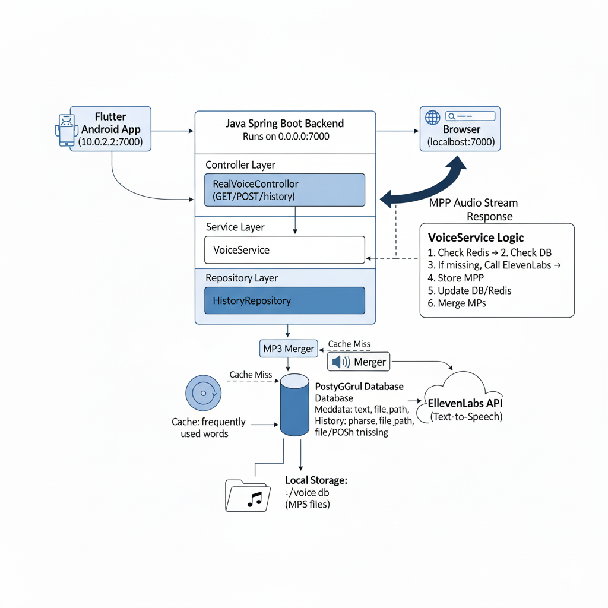

# 🎙️ Alfred Voice AI Backend

A smart **Voice AI backend** built with **Spring Boot**, **PostgreSQL**, **Redis**, and **ElevenLabs TTS API**.  
It converts text into speech, caches previously generated audio, merges word-level audio clips, and serves optimized voice responses.  

---

## 📌 Features

- 🔊 **Text-to-Speech (TTS)** using **ElevenLabs API**.  
- 🗃️ **Caching with Redis + PostgreSQL**:
  - First check if requested text/word exists in the database.  
  - If exists → retrieve stored audio file.  
  - If not → call ElevenLabs API, generate audio, store in DB + filesystem.  
- 🧩 **Word Reuse & Merging**:  
  - Breaks sentences into words.  
  - If part of a sentence exists (e.g., `good`), only generates missing part (`night`) and merges audio → returns “good night”.  
- 💾 **Local MP3 Storage** with option to switch to cloud storage (S3).  
- 🕒 **History Logging** of all user requests.  
- 🚀 **REST API** endpoints for integration with mobile or web apps.  

---

## 🖼️ System Architecture

**Workflow**:  
1. User sends text → `http://<host>:7000/real/voice?text=hello world`  
2. Backend checks Redis cache → PostgreSQL DB.  
3. If text exists → return stored audio.  
4. If not:
   - Split text into words.  
   - Check each word in cache/DB.  
   - Generate missing words via ElevenLabs API.  
   - Merge audio segments.  
   - Store merged MP3 locally (`/voice_db`) + save reference in DB.  
5. Return final MP3 link to user.  

---

## ⚙️ Tech Stack

- **Backend Framework**: Spring Boot (Java)  
- **Database**: PostgreSQL  
- **Cache**: Redis  
- **TTS API**: ElevenLabs  
- **Storage**: Local file system (default) / S3 (optional)  
- **Build Tool**: Gradle  

---

⚡ Setup & Run
git clone https://github.com/emranisking/alfred-voice-ai-backend.git
cd alfred-voice-ai-backend

2️⃣ Configure Database & Redis
spring:
  datasource:
    url: jdbc:postgresql://localhost:5432/alfred_voice
    username: postgres
    password: yourpassword

  redis:
    host: localhost
    port: 6379

elevenlabs:
  api-key: YOUR_ELEVENLABS_API_KEY
  api-url: https://api.elevenlabs.io/v1
  default-voice: pqHfZKP75CvOlQylNhV4

run the project

